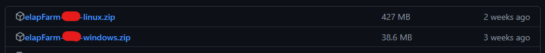

# Official ElaptaCoin PoS Farmer
Welcome to the official page of ElaptaCoin Proof of Space Farmer!

**Farming utilizes data drives, proving you have certain file. This does not require much power.**

#### Platform support
1. Windows 10/11 (Theoretically Windows 7)
2. Linux x32/x64
3. ARM x64/x32 (Including Android devices with Termux installed)


**DISCLAIMER: There are few instability issues ongoing with the PoS Farmer currently!**

# ElaptaCoin PoS Farmer Setup Guide
## Windows and Linux (Packed Executable)
### 1. Download .zip folder for your targeted platform (Linux/Windows) 
You can find the latest release on https://github.com/DuckyPolice/Elaptacoin-PUBLIC/releases/latest


### 2. Unzip the zip folder.

### 3. Execute the farmer
**If you are trying to execute the miner on linux, you might need to use this chmod command `chmod +x`**
Open the farmer, the name of the farmer is `farmer.exe` for windows and for linux is `farmer`

### 4. Configure the farmer
Close the farmer

Open the file `config.json` that was created in the folder where is the farmer

The inside of `config.json` should look like this:

```
{
    "plot_directories": [
        "D:\\",
        "C:\\Users\\tomma\\Desktop\\elapFarm-1.2.1-windows\\_internal"
    ],
    "username": "jerrbar",
    "server_ip": "147.185.221.21:20234"
}
```

Replace `username` with username of your Elaptacoin account
###### Don't have account yet? Follow the guide on [read me page](README.md)

Replace the first entry `D:\\` with existing directory where you want to have your plots
###### Keep the second entry there! It is neccesary to run the farmer

If you want to use linux, you need to use file format. `/home` etc...

###### For example, I am going replace the `D:\\` with `C:\\myfolder`

Save the file.

### 5. Generate the plots
The plots are needed for farming, so you want to generate them

You can create up to 32 plots, each one is 3,8 GB in size. For bigger succes in farming. You want to have all 32 plots. But watch out for your drive size!

So to generate plots, you want to open the farmer again

Then enter `plot` and type number `0` to `32`
###### We recommend to generating plots in order to don't cause chaos in plots

### 6. Start mining
Enter `farm` and start mining!

**There is issue with instability, often the miner can restart itself, to interrupt the restarting process, just press any key.**

## ARM Based Devices
### 1. Download .zip folder with the source code 

Make sure you are in `/home/yourusername` directory

Copy the link of the `Source code.zip` https://github.com/DuckyPolice/Elaptacoin-PUBLIC/releases/latest


After you copied the link use `wget {link}` to download the `Source code.zip`

### 2. Unzip the zip folder.
Use `unzip {file name}` to unzip the `Source code.zip`


### 3. Execute the farmer
Execute the farmer by entering `python farmer.py`

### 4. Configure the farmer
Close the farmer

Open the file `config.json` that was created in the folder where is the farmer
###### You can use `nano config.json` to edit the config inside bash


The inside of `config.json` should look like this:

```
{
    "plot_directories": [
        "D:\\",
        "C:\\Users\\tomma\\Desktop\\elapFarm-1.2.1-windows\\_internal"
    ],
    "username": "jerrbar",
    "server_ip": "147.185.221.21:20234"
}
```

Replace `username` with username of your Elaptacoin account
###### Don't have account yet? Follow the guide on [read me page](README.md)

Replace the first entry `D:\\` with existing directory where you want to have your plots

###### For example, I am going replace the `D:\\` with `/home/tommarek/farmPlots`

Save the file.

### 5. Generate the plots
The plots are needed for farming, so you want to generate them

You can create up to 32 plots, each one is 3,8 GB in size. For bigger succes in farming. You want to have all 32 plots. But watch out for your drive size!

So to generate plots, you want to open the farmer again by `python farmer.py`

Then enter `plot` and type number `0` to `32`
###### We recommend to generating plots in order to don't cause chaos in plots

### 6. Start mining
Enter `farm` and start mining!

**There is issue with instability, often the miner can restart itself, to interrupt the restarting process, just press any key.**

###### - Elaptacoin Team 2024, Written by tommarek
